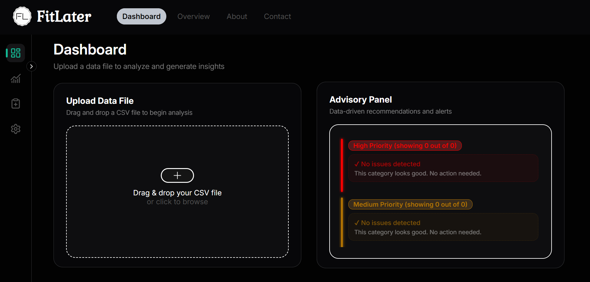
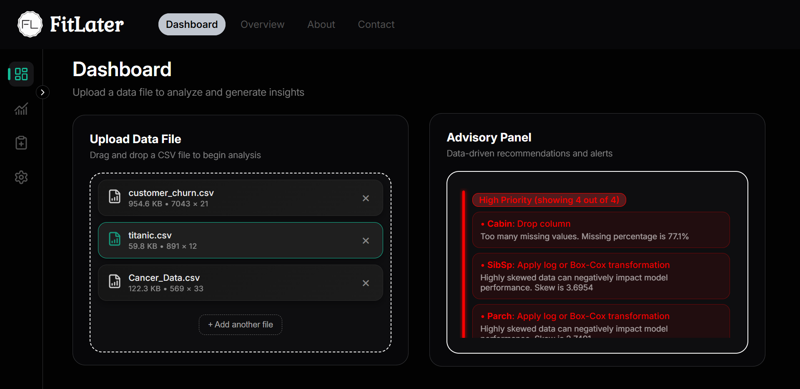
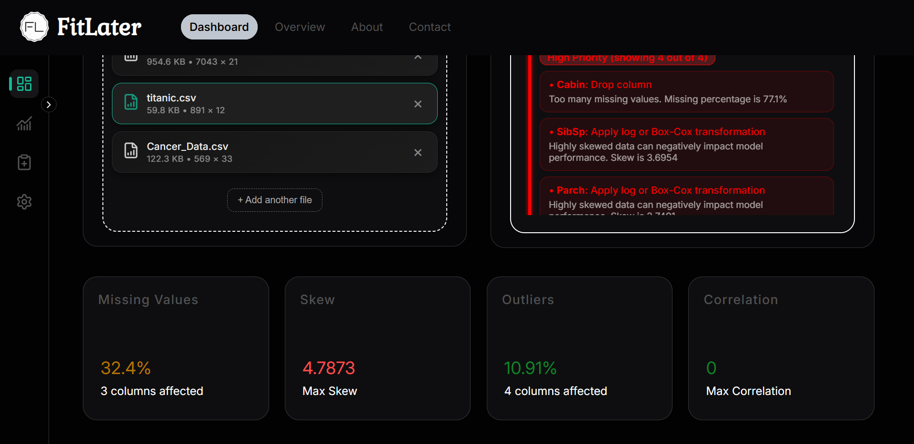
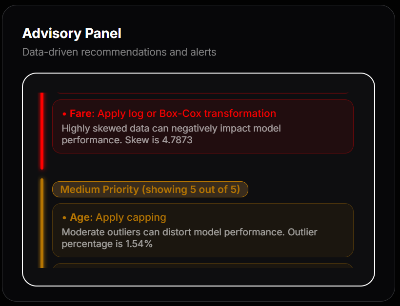
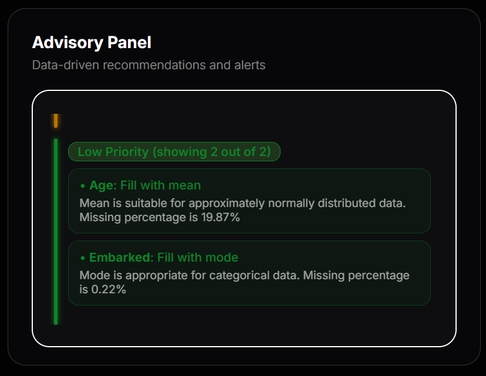

# FitLater

## Version 0.4.1

- Introduced frontend UI (HTML, CSS, JavaScript)
- Added backend API layer (FastAPI)
- Integrated UI with FitLater pipeline
- Refactored core architecture (Descriptive → Diagnostics → Advisory)
- Added configurable diagnostics and advisory output (`--full`)
- Improved diagnostics and advisory consistency

---

## Philosophy

FitLater follows a simple principle:

> Understand first, model later.

---

## What is FitLater?

FitLater is a data analysis system designed to help users understand their dataset before building machine learning models.

It follows a structured pipeline:

Descriptive → Diagnostics → Advisory

- **Descriptive**: Extracts factual dataset information  
- **Diagnostics**: Detects data issues  
- **Advisory**: Recommends preprocessing actions  

This separation ensures clarity, modularity, and scalability.

---

## Screenshots

### Dashboard (Empty State)


### Dashboard (After Upload)




### Advisory Panel (High Priority)


### Advisory Panel (Mixed Priorities)


---

## What FitLater is NOT

FitLater is not an AutoML tool.

It does not:
- Perform hyperparameter tuning  
- Recommend models  
- Run training or evaluation pipelines  

It focuses strictly on data understanding and preprocessing guidance.

---

## Features

- Structured EDA pipeline  
- Automated issue detection  
- Priority-based recommendations  
- Configurable output (`--full`)  
- Column-level insights  
- CLI-based workflow  
- FastAPI backend + custom UI  
- 360+ unit tests  

---

## Architecture

FitLater follows a layered design:

### Descriptive Layer (Facts)

Provides structured, factual information about the dataset:

- Dataset shape and metadata  
- Column-level summaries  
- Data types (without modification)  

---

### Diagnostics Layer (Problems)

Identifies potential issues in the dataset:

- Missing values  
- Outliers  
- Skewed distributions  
- Feature correlations  
- Data type inconsistencies  
- Duplicates and imbalance  

---

### Advisory Layer (Decisions)

Transforms detected issues into actionable recommendations:

- Data cleaning strategies  
- Feature transformations  
- Data quality improvements  

Severity-based prioritization:

- High → Must fix  
- Medium → Should consider  
- Low → Informational (visible with `--full`)  

---

## Frontend (v0.4.1)

FitLater includes a custom-built UI for interactive data analysis.

- Upload datasets directly from the browser  
- View diagnostics and advisory outputs visually  
- Sidebar-based navigation  
- Modular panel design  

Note: UI is under active development.

---

## API Layer (v0.4.1)

A FastAPI-based backend connects the frontend with the FitLater engine.

- Handles dataset upload and processing  
- Executes full pipeline  
- Returns structured JSON responses  

---

## Testing

FitLater includes 360+ unit and integration tests covering:

- Edge cases  
- Layer-wise validation  
- Full pipeline consistency  
- Deterministic outputs  

Run tests:

```bash
pytest
```

## Quick Start

**Requirements:** Python 3.10+

### Setup

git clone https://github.com/jitesh2511/FitLater
cd FitLater
python -m venv .venv

Activate the virtual environment:

- Windows: .venv\Scripts\activate  
- macOS/Linux: source .venv/bin/activate

Install dependencies:

pip install -r requirements.txt

---

## CLI Usage

Run FitLater:

python -m fitlater

### Commands

load <file>             # load dataset  
diagnostics             # view detected issues  
diagnostics --full      # include low priority issues
advisory                # high + medium priority advice  
advisory --full         # include low priority advice  

---

### Example Workflow

```
load data/test.csv  
diagnostics  
advisory --full
```

---

## UI Usage (v0.4.1)

### Start Backend API
```bash
uvicorn backend.app:app --reload
```
### Open Frontend

Open index.html in your browser  
> (or use Live Server in VS Code)

---

### Workflow

1. Upload a CSV file  
2. Backend processes the dataset  
3. View diagnostics and advisory results in the dashboard  

**Note:** The UI is currently under active development. While core functionality is supported, some features available in the CLI are not yet integrated. Full feature parity is planned in future updates.

---

## Summary

FitLater is a structured system for data understanding that helps users:

- detect issues early  
- prioritize fixes  
- prepare data effectively  

before moving to modeling.

---

## License

This project is licensed under the MIT License.

See the LICENSE file for details.

---

## Attribution

If you use FitLater in your work, consider citing or linking back:

https://github.com/jitesh2511/FitLater