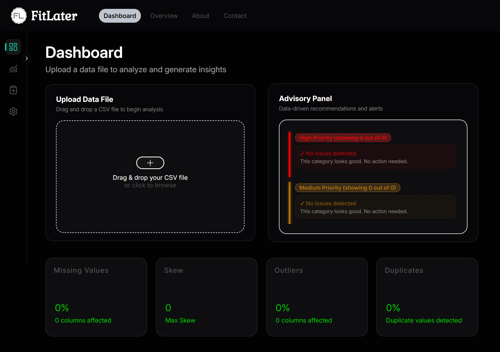
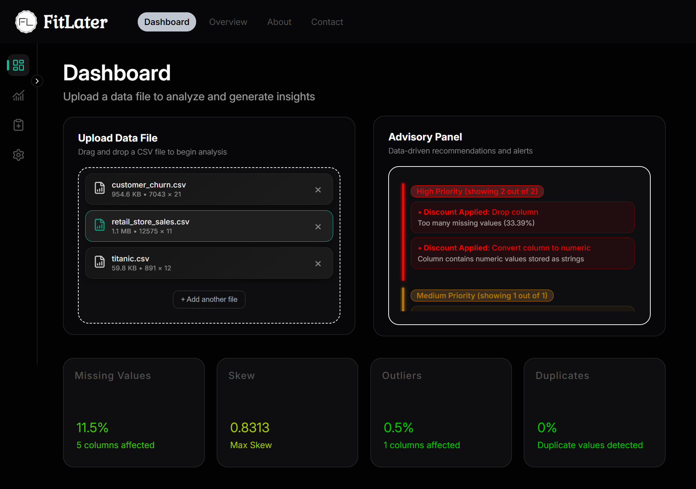
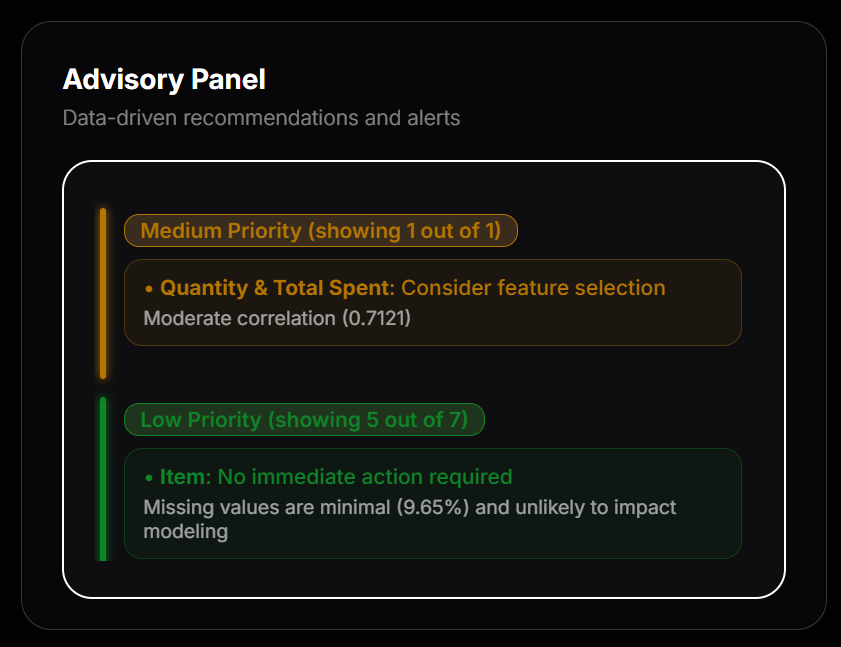
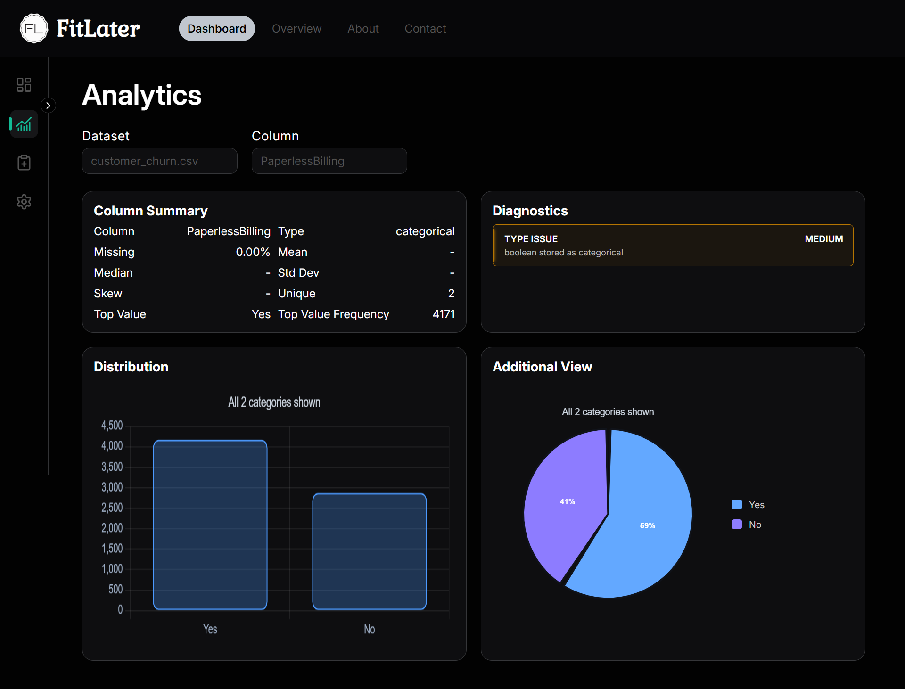
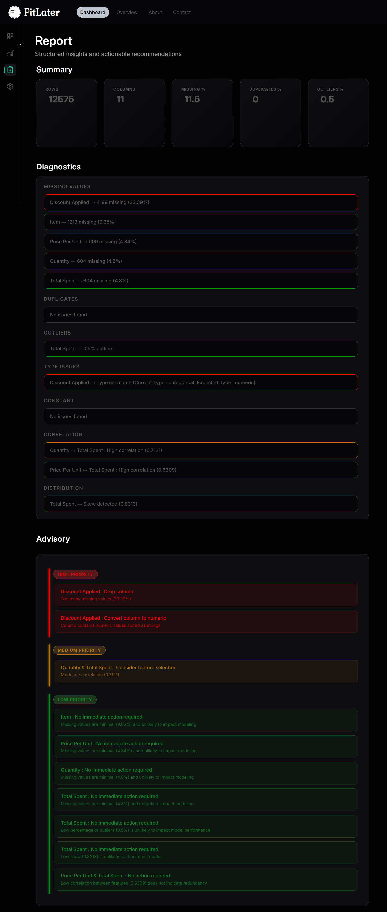

# FitLater

> Understand your data first. Fit models later.

FitLater is a structured data analysis system designed to help you **analyze, diagnose, and prepare datasets** before building machine learning models.

---

## Version 1.0.0

- First stable release of FitLater
- Custom frontend UI (HTML, CSS, JavaScript)
- FastAPI backend for processing pipeline
- Full integration between UI and core engine
- Modular architecture (Descriptive → Diagnostics → Advisory)

---

## Philosophy

FitLater follows a simple principle:

> Understand first, model later.

---

## What is FitLater?

FitLater is a structured EDA (Exploratory Data Analysis) system that focuses on **understanding data before modeling**.

Unlike traditional tools that focus on charts and summaries, FitLater emphasizes:

- Detecting data issues  
- Explaining problems clearly  
- Recommending actionable preprocessing steps

It follows a modular pipeline:

**Descriptive → Diagnostics → Advisory**

- **Descriptive** → What the data *is*  
- **Diagnostics** → What’s *wrong* with the data  
- **Advisory** → What you *should do* about it

This separation ensures clarity, scalability, and real-world usability.

---

## Screenshots

### Dashboard (Empty State)



### Dashboard (After Upload)



### Advisory Panel



### Analytics Page



### Report Page



---

## What FitLater is NOT

FitLater is not an AutoML tool.

It does not:

- Perform hyperparameter tuning  
- Recommend models  
- Run training or evaluation pipelines

It focuses strictly on data understanding and preprocessing guidance.

---

## Features

- Structured EDA pipeline (Descriptive → Diagnostics → Advisory)  
- Automated detection of data issues  
- Priority-based recommendations (High / Medium / Low)  
- Column-level diagnostics and insights  
- Configurable outputs (`--full`)  
- Robust validation and error handling  
- 400+ unit and integration tests

---

## System Overview

FitLater consists of three main components:

### Frontend

- Custom-built UI (HTML, CSS, JavaScript)
- Dashboard with important metrics like Missing %, Skew, etc.
- Analytics Page with column-wise analytics and distribution graphs
- Report Page with combined summary, diagnostics and advisory

### Backend (FastAPI)

- Handles dataset upload and validation
- Executes full processing pipeline
- Returns structured JSON responses

### Core Engine

- Implements Descriptive, Diagnostics, and Advisory layers
- Fully modular and test-driven architecture

---

## Testing

FitLater includes 400+ unit and integration tests covering:

- Edge cases  
- Layer-wise validation  
- Full pipeline consistency  
- Deterministic outputs

Run tests:

```bash
pytest
```
> Run this after setup, look under Quick Start for more context
---

## Quick Start

**Requirements:** Python 3.10+

### Setup

```bash
git clone https://github.com/jitesh2511/FitLater
cd FitLater

python -m venv .venv
```

### Activate virtual environment

- **Windows:**

```bash
.venv\Scripts\activate
```

- **macOS/Linux:**

```bash
source .venv/bin/activate
```

### Install dependencies

```bash
pip install -r requirements.txt
```

---

## CLI Usage

### Run FitLater

```bash
python -m fitlater
```

---

## Available Commands

```text
load <file>             Load dataset  
diagnostics             View detected issues  
diagnostics --full      Include low priority issues  
advisory                View high + medium priority advice  
advisory --full         Include low priority advice  
```

---

## Example Workflow

```bash
load data/test.csv
diagnostics
advisory --full
```

---

## UI Usage

### Start Backend API

```bash
uvicorn backend.app:app
```

> To update changes while API is running use `--reload` flag at the end of the command

---

### Start Frontend

Open `index.html` in your browser  

> Tip: Use **Live Server (VS Code extension)** for a smoother experience

---

### Workflow

1. Upload a CSV file
2. Backend processes the dataset
3. View diagnostics and advisory results in the Dashboard
4. Explore column-wise insights in the Analytics page
5. Access the complete report in the Report page

---

### Notes

- Ensure backend is running before using the UI  
- CLI provides full feature access, while UI focuses on interactive analysis

---

## Summary

FitLater is a structured system for data understanding that helps users:

- Detect issues early  
- Prioritize fixes effectively  
- Make informed preprocessing decisions

before moving to modeling.

It bridges the gap between **EDA and practical data preparation**.

---

## License

This project is licensed under the MIT License.

See the [LICENSE](LICENSE) file for details.

---

## Attribution

If you use FitLater in your work, consider citing or linking back:

[https://github.com/jitesh2511/FitLater](https://github.com/jitesh2511/FitLater)